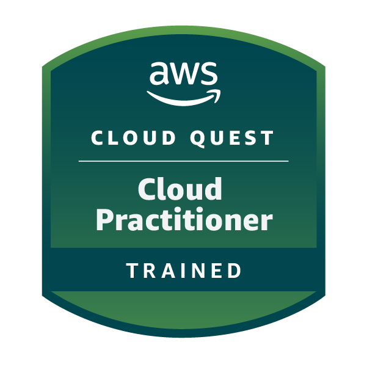

📚 WHAT I LEARNED
1. Cloud Computing Essentials
IaaS, PaaS, SaaS models, AWS global infrastructure, and cloud deployment strategies.

2. Cloud First Steps
AWS Management Console navigation, account setup, and basic service exploration.

3. Computing Solutions
EC2 instance types, pricing models (On-Demand, Reserved, Spot), AMIs, and Elastic IPs.

4. Networking Concepts
VPC fundamentals, public/private subnets, route tables, internet gateways, and security groups.

5. Cloud Economics
Total Cost of Ownership (TCO), AWS Pricing Calculator, cost optimization, and billing models.

6. Databases in Practice
RDS, Multi-AZ deployments, read replicas, backups, and disaster recovery.

7. Connecting VPCs
VPC peering, VPN connections, transit gateways, and hybrid networking architectures.

8. First NoSQL Database
Amazon DynamoDB – tables, items, attributes, primary keys, and basic CRUD operations.

9. File Systems in the Cloud
Amazon EFS and FSx family – shared file storage, NFS/SMB protocols, cross-instance mounting.

10. Core Security Concepts
IAM policies, users/groups/roles, least privilege access, MFA, and shared responsibility model.

11. Auto-Healing and Scaling Applications
Auto Scaling Groups, launch templates, scaling policies (dynamic and scheduled), and health checks.

12. Highly Available Web Applications
Application Load Balancers, Multi-AZ deployments, fault tolerance, and disaster recovery principles.

🛠️ AWS SERVICES USED
Category	Services
Compute	Amazon EC2, Auto Scaling, Elastic Load Balancing
Storage	Amazon S3, EBS, EFS, FSx
Databases	Amazon RDS, DynamoDB
Networking	Amazon VPC, Subnets, VPC Peering, Transit Gateway, VPN
Security	AWS IAM, Security Groups, MFA
Cost Management	AWS Pricing Calculator, TCO Analysis

✅ Key Takeaways

Cloud computing removes the need for physical infrastructure management. Through AWS Re/Start, I learned how to design, deploy, and secure cloud solutions using real AWS services – from EC2 compute to DynamoDB databases to VPC networking.

🏆 Certificate

